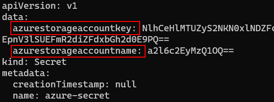
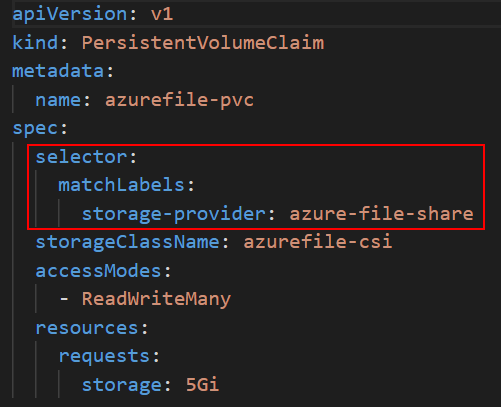
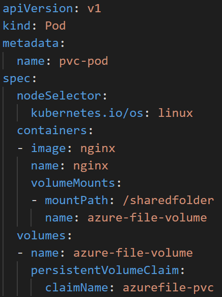
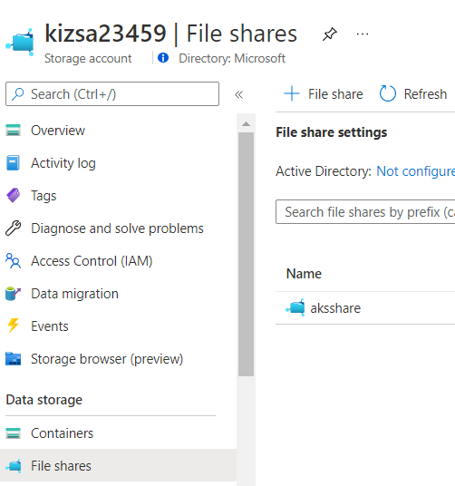
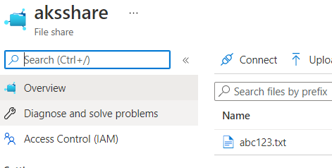
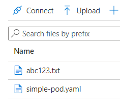

# Lab Module 3: Intermediate Kubernetes Concepts


> Estimated Duration: 60 minutes

## Module 3 Table of Contents

[Create a Basic Cluster](#create-a-basic-cluster)

[Exercise: Working with Multi-Container Pods, Ephemeral Volumes and ConfigMaps](#exercise-working-with-multi-container-pods-ephemeral-volumes-and-configmaps)

[Exercise: Working with Persistent Volumes, Persistent Volume Claims and Secrets](#exercise-working-with-persistent-volumes-persistent-volume-claims-and-secrets)

[Exercise: Using Ingress Resources and Ingress Controller to Control External Access](#exercise-using-ingress-resources-and-ingress-controller-to-control-external-access)

[Shutdown or Delete the Cluster](#shutdown-or-delete-the-cluster)

# Create a Basic Cluster

For the exercises in this module, you'll need simple AKS cluster.

### Task 1 - Create an AKS cluster

1. Select the region closest to your location. Use '**eastus**' for United States workshops, '**westeurope**' for European workshops. Ask your instructor for other options in your region: @lab.DropDownList(region)[eastus,westus,canadacentral,westeurope,centralindia,australiaeast]

2. Define variables (update as needed)

```PowerShell
$INITIALS="abc"
```

```PowerShell
$YOUR_INITIALS="$($INITIALS)".ToLower()
$AKS_RESOURCE_GROUP="azure-$($INITIALS)-rg"
$VM_SKU="Standard_D2as_v5"
$AKS_NAME="aks-$($INITIALS)"
$NODE_COUNT="3"
$LOCATION="@lab.Variable(region)"
```

3. Create Resource Group

```PowerShell
az group create --location $LOCATION `
                --resource-group $AKS_RESOURCE_GROUP
```

4. Create Basic cluster.

```PowerShell
az aks create --node-count $NODE_COUNT `
              --generate-ssh-keys `
              --node-vm-size $VM_SKU `
              --name $AKS_NAME `
              --resource-group $AKS_RESOURCE_GROUP
```

5. Connect to local environment

```PowerShell
az aks get-credentials --name $AKS_NAME `
                       --resource-group $AKS_RESOURCE_GROUP
```

6. Verify connection

```PowerShell
kubectl get nodes
```

# Exercise: Working with Multi-Container Pods, Ephemeral Volumes and ConfigMaps

This exercise shows how multiple containers within the same pod can use volumes to communicate with each other and how you can use _ConfigMaps_ to mount settings files into containers.

The example Deployment below configures a MySQL instance to write its activities to a log file. Another container reads that log file, and in a production setting, would send the contents to an external log aggrigator. In this example, the 2nd container just outputs the _tail_ of the log file to the console.

### Task 1 - Review and deploy ConfigMaps

1. Open a Windows Terminal window (defaults to PowerShell).


2. Change current folder to **Module3**

```PowerShell
cd  C:\k8s\labs\Module3
```

3. Review the **mysql-initdb-cm.yaml** file. 

```PowerShell
cat mysql-initdb-cm.yaml
```
This sql script will be used to initialize the database.

```yaml
apiVersion: v1
kind: ConfigMap
metadata:
  name: mysql-initdb-cm
data:
  initdb.sql: |
    CREATE DATABASE sample;
    USE sample;
    CREATE TABLE friends (id INT, name VARCHAR(256), age INT, gender VARCHAR(3));
    INSERT INTO friends VALUES (1, 'John Smith', 32, 'm');
    INSERT INTO friends VALUES (2, 'Lilian Worksmith', 29, 'f');
    INSERT INTO friends VALUES (3, 'Michael Rupert', 27, 'm');
```

When the ConfigMap is mounted in a container, it will create a file called **initdb.sql**.

4. Deploy the ConfigMap.

```PowerShell
kubectl apply -f mysql-initdb-cm.yaml
```

5. Configure MySql to generate activity logs and save them to a file. Review the contents of **mysql-cnf-cm.yaml**. This file will replace the default **my.cnf** config file in the container.

```yaml
apiVersion: v1
kind: ConfigMap
metadata:
  name: mysql-cnf-cm
data:
  my.cnf: |
    !includedir /etc/mysql/conf.d/
    !includedir /etc/mysql/mysql.conf.d/

    [mysqld]
    #Set General Log
    general_log = on
    general_log_file=/usr/log/general.log
```

6. Deploy the ConfigMap.

```PowerShell
kubectl apply -f mysql-cnf-cm.yaml
```

### Task 2 - Review and deploy multi-container Deployment

1. Review the Volumes section of **mysql-dep.yaml**.

```yaml
volumes:
  - name: mysql-initdb
    configMap:
      name: mysql-initdb-cm
  - name: mysql-cnf
    configMap:
      name: mysql-cnf-cm
  - name: mysql-log
    emptyDir: {}
```

> Notice that both ConfigMaps are being mapped to volumes and an empty directory is being created for the logs.

2. Review the volumeMounts section of **mysql-dep.yaml**.

```yaml
volumeMounts:
  - name: mysql-initdb
    mountPath: /docker-entrypoint-initdb.d
  - name: mysql-cnf
    mountPath: /etc/mysql/my.cnf
    subPath: my.cnf
  - name: mysql-log
    mountPath: /usr/log/
```

The init file is mapped to the known MySql folder. Anything placed is that folder is executed by MySql during it startup.

The config file is mapped to the MySql config folder. However, there are other config files already in that folder that MySql needs to access. As a result, replacing the entire folder with the contents of the ConfigMap will prevent MySql from working, because the other config files won't be there.

That's where the _subPath_ property comes into play. It allow you to mount only a subset of your volume (in this case only a single file), leaving the exiting content in place at the destination.

The final mount points to the empty directory created to hold the logs.

3. Review the second container definition.

```yaml
- name: logreader
  image: busybox
  command:
    - "/bin/sh"
  args:
    - "-c"
    - "tail -f /usr/log/general.log;"
  volumeMounts:
    - name: mysql-log
      mountPath: /usr/log/
```

> Notice that the same empty directory is mounted to this container and that the container simply executes a _tail_ command, outputting the last line in the file.

4. Apply the deployment.

```PowerShell
kubectl apply -f mysql-dep.yaml
```

### Task 3 - Confirm communications between containers

1. Get list of Pods.

```PowerShell
kubectl get pods
```

2. Once the Pod is running, look at the log of the second container.

```PowerShell
kubectl logs -c logreader -f "name of mysql-dep-xxxxx pod"
```

3. Open another shell window and execute into the first container

```PowerShell
kubectl exec -it -c mysql "name of mysql-dep-xxxxx pod" -- bash
```

4. In the shell, type **mysql** to enter the MySql console.

```bash
mysql
```

5. Type the following commands in the **_mysql>_** prompt:

```bash
use sample;
select * from friends;
```

6. Switch to the other window and verify that the second container is showing the log.


7. Exit out of the **MySql** console.

```bash
exit;
```

8. Exit out of the container.

```bash
exit
```

[Module 3 Table of Contents](#module-3-table-of-contents)

[List of Modules](#modules-list)

# Exercise: Working with Persistent Volumes, Persistent Volume Claims and Secrets

This exercise shows an example of using a secret to store the password needed by an Azure File Share. You will first create the Azure File Share, get its Access Key and then configure a secret to use that access key to connect a volume to a Pod.

### Task 1 - Create an Azure Storage Account and an Azure File Share

1. Open a Windows Terminal window (defaults to PowerShell).


2. Login to Azure.

```PowerShell
az login
az account set --subscription "Azure Pass - Sponsorship"
```

3. Define variables.

```PowerShell
$INITIALS="abc"
```

```PowerShell
$YOUR_INITIALS="$($INITIALS)".ToLower()
$AKS_RESOURCE_GROUP="azure-$($INITIALS)-rg"
$STORAGE_ACCOUNT_NAME="sa$($YOUR_INITIALS)"
$SHARE_NAME="share$($YOUR_INITIALS)"
$LOCATION="@lab.Variable(region)"
```

4. Create the Azure Storage Account.

```PowerShell
az group create --location $LOCATION  --resource-group $AKS_RESOURCE_GROUP

az storage account create --name $STORAGE_ACCOUNT_NAME `
                          --resource-group $AKS_RESOURCE_GROUP `
                          --sku Standard_LRS
```

5. Create the Azure File Share.

```PowerShell
az storage share create --name $SHARE_NAME `
                        --connection-string `
                        $(az storage account show-connection-string `
                        --name $STORAGE_ACCOUNT_NAME `
                        --resource-group $AKS_RESOURCE_GROUP -o tsv)
```

6. The **_Account Name_** and **_Account Key_** will be echoed to the screen for reference.

```PowerShell
$STORAGE_KEY=$(az storage account keys list `
       --resource-group $AKS_RESOURCE_GROUP `
       --account-name $STORAGE_ACCOUNT_NAME `
       --query "[0].value" -o tsv)

$STORAGE_ACCOUNT_NAME
$STORAGE_KEY
```

### Task 2 - Create a Namespace for this lab

All the objects related to this lab will be self-contained in a Namespace. When you're done, delete the Namespace and all the objects it contains will also be deleted. The the Persistent Volume, which is scoped across the entire cluster, will remain.

1. Create a new Namespace.

```PowerShell
kubectl create ns lab3volume
```

2. Set the new Namespace as the current namespace, so it doesn't have to be specified in future commands.

```PowerShell
kubectl config set-context --current --namespace lab3volume
```

### Task 3 - Create a Secret imperatively

1. The **_Account Name_** and **_Account Key_** need to be saved into a Kubernetes Secret object. The best way to do this is to create the Secret imperatively:

```PowerShell
kubectl create secret generic azure-secret `
      --from-literal=azurestorageaccountname=$STORAGE_ACCOUNT_NAME `
      --from-literal=azurestorageaccountkey=$STORAGE_KEY `
      --dry-run=client `
      --namespace lab3volume `
      -o yaml > azure-secret.yaml
```

2. A YAML file is generated with all the information needed to create the secret. Review the new file.

```PowerShell
cat azure-secret.yaml
```

**NOTE:** It's best to create the file first and then apply it so you can repeat the process if needed.



3. Apply the secret in the **default** namespace. Since the Persistent Volume is not a namespaced resource, it will expect to find the secret in the **default** namespace.

```PowerShell
kubectl apply -f azure-secret.yaml -n lab3volume
```

### Task 4 - Create a Persistent Volume and a Persistent Volume Claim

The first step to accessing an Azure File Share is creating a _PersistentVolume_ object that connects to that share.

1. Review the value of **SHARE_NAME** created in Task 1 above.

```
echo $SHARE_NAME
```

**CRITICAL STEP:**

2. Review the contents of **azurefile-pv.yaml**. Make sure the **shareName** property matches the value of **SHARE_NAME**.


3. Also notice there's a label associated with the persistent volume:


4. When the file is ready, apply it.

```PowerShell
kubectl apply -f azurefile-pv.yaml
```

5. Make sure the _PersistentVolume_ was created and has a status of _Available_.

```PowerShell
kubectl get pv
```


6. Review the contents of **azurefile-pvc.yaml**. Notice that the label selector is set to look for the persistent volume:



Also the label selector is set to find the PV.

7. Apply the Persistent Volume Claim.

```PowerShell
kubectl apply -f azurefile-pvc.yaml
```

8. Verify that the Persistent Volume Claim is _bound_ to the Persistent Volume.

```PowerShell
kubectl get pvc
```


9. Review the PersistentVolume again

```PowerShell
kubectl get pv
```


Notice that the PVC claimed the PV:

### Task 5 - Use the Persistent Volume Claim in a Pod

Now that the connection is configured to the Azure File Share, create a Pod to use the Persistent Volume Claim.

1. Review the contents of **pvc-pod.yaml**. Notice how the _persistentVolumeClaim_ is being used and _mountPath_ of the _volumeMount_.



2. Apply the Pod.

```PowerShell
kubectl apply -f pvc-pod.yaml
```

3. Confirm the Pod is running. It might take a few minutes for the Pod to connect to the PVC.

```PowerShell
kubectl get pod pvc-pod
```

4. Once the Pod is running, shell into the Pod.

```PowerShell
kubectl exec -it pvc-pod -- bash
```

5. Change into the shared folder, create a file and confirm it's there.

```PowerShell
cd /sharedfolder
touch abc123.txt
ls -l
```

6. Open the Azure Portal in a browser.
7. Navigate to the storage account created earlier (as defined in **STORAGE_ACCOUNT_NAME**).

8. Click on the File shares selection.



9. Click on the file share name.



10. You should see the file you created in the container. Click the **Upload** button and upload a file from your hard drive to the share.



10. Get a list of files in the shared folder again.

```PowerShell
ls -l
```

Both files should be in the shared folder:


This confirms that the **sharedfolder** is mapped to the Azure File Share.

11. Exit the container.

```bash
exit
```

### Task 6 - Set the current Namespace back to default

1. Set the current namespace back to default so all of these objects stay separate from the other labs.

```PowerShell
kubectl config set-context --current --namespace default
```

2. **OPTIONAL**: If you prefer, you can delete the namespace. This will delete all the objects (secrets, persistent volume claim, pods) from the cluster. The only object that will remain will be the Persistent Volume, because it's not tied to any specific namespace.

```PowerShell
kubectl delete ns lab3volume
```

[Module 3 Table of Contents](#module-3-table-of-contents)

[List of Modules](#modules-list)

# Exercise: Using Ingress Resources and Ingress Controller to control external access

Ingress resources and 3rd-party Ingress Controllers can be used to centrally control external access to the cluster.

### Task 1 - Install NGinx Ingress Controller

1. Change current folder to **C:\k8s\labs\Module3**.

```PowerShell
cd C:\k8s\labs\Module3
```

2. Install **Nginx Ingress Controller** using **Helm**:

```PowerShell
helm repo add ingress-nginx https://kubernetes.github.io/ingress-nginx
helm repo update
```

```PowerShell
helm upgrade --install ingress-nginx ingress-nginx `
    --repo https://kubernetes.github.io/ingress-nginx `
    --namespace ingress-nginx --create-namespace `
    --set controller.nodeSelector."kubernetes\.io/os"=linux `
    --set defaultBackend.nodeSelector."kubernetes\.io/os"=linux `
    --set controller.service.externalTrafficPolicy=Local `
    --set defaultBackend.image.image=defaultbackend-amd64 `
    --set defaultBackend.image.tag=1.5

```

3. Wait a few minutes to allow the Nginx Load Balancer service to aquire an external IP address.

4. Query the services in the **_ingress-nginx_** namespace.

```PowerShell
kubectl get svc -n ingress-nginx
```

Get the _EXTERNAL IP_ of the Load Balancer:

```console
NAME                                         TYPE           CLUSTER-IP     EXTERNAL-IP     PORT(S)                      AGE
service/ingress-nginx-controller             LoadBalancer   10.0.240.47    52.146.66.160   80:32616/TCP,443:31149/TCP   108s
service/ingress-nginx-controller-admission   ClusterIP      10.0.244.155   <none>          443/TCP                      108s
```

### Task 2 - Define a Default Backend

1. Open the browser and enter the exnteral IP of the Ingress controller by itself: **http://"external ip"**


This is the default NGinx Ingress Controller page.

2. Review the contents of **C:\k8s\labs\Module3\default-backend.yaml** file in an editor. Notice the special property to specify the default backend. There's no _path_ property needed.

```yaml
apiVersion: networking.k8s.io/v1
kind: Ingress
metadata:
  name: default-ingress-backend
spec:
  defaultBackend:
    service:
      name: default-svc
      port:
        number: 8100
```

3. Apply the _Default Backend_ deployment, service and ingress resource to the _default_ namespace (not _dev_).

```PowerShell
kubectl apply -f default-dep.yaml -n default
kubectl apply -f default-svc.yaml -n default
kubectl apply -f default-backend.yaml -n default
```

4. Open the browser and enter the exnteral IP of the Ingress controller by itself: **http://"external ip"**


### Task 3 - Install Deployments, Services and Ingress Resource in a separate namespace

1. Create the _dev_ namespace

```PowerShell
kubectl create ns dev
```

2. Change current folder to **C:\k8s\labs\Module3**.

```PowerShell
cd C:\k8s\labs\Module3
```

3. Apply the deployments and services.

```PowerShell
kubectl apply -f blue-dep.yaml -f blue-svc.yaml -n dev
kubectl apply -f red-dep.yaml -f red-svc.yaml -n dev
```

4. Review the contents of **C:\k8s\labs\Module3\colors-ingress.yaml** file in an editor. Notice the _path_ setting to route traffic to the correct service.

```yaml
apiVersion: networking.k8s.io/v1
kind: Ingress
metadata:
  annotations:
    kubernetes.io/ingress.class: nginx
    nginx.ingress.kubernetes.io/rewrite-target: /$1
  name: colors-ingress
spec:
  rules:
    - http:
        paths:
          - path: /blue/(.*)
            pathType: Prefix
            backend:
              service:
                name: blue-svc
                port:
                  number: 8100
          - path: /red/(.*)
            pathType: Prefix
            backend:
              service:
                name: red-svc
                port:
                  number: 8100
```

5. Apply the Ingress resource.

```PowerShell
kubectl apply -f colors-ingress.yaml -n dev
```

6. Verify the ingress resource was created.

```PowerShell
kubectl get ing -n dev
```

Returns:

```console
NAME             CLASS    HOSTS   ADDRESS   PORTS   AGE
colors-ingress   <none>   *                 80      16s
```

### Task 4 - Access Pods From a single external IP

1. Open the browser and enter the exnteral IP of the Ingress controller service and append "/blue/" to the path: **http://"external ip"/blue/** (make sure to include the last /).


2. Open the browser and enter the exnteral IP of the Ingress controller service and append "/red/" to the path: **http://"external ip"/red/** (make sure to include the last /)


[Module 3 Table of Contents](#module-3-table-of-contents)

[List of Modules](#modules-list)

# Shutdown or Delete the Cluster

When you're done for the day, you can shutdown your cluster to avoid incurring charges when you're not using it. This will delete all your nodes, but keep your configuration in tact.

```PowerShell
az aks stop --name $AKS_NAME `
            --resource-group $AKS_RESOURCE_GROUP
```

Or you can choose to delete the entier resource group instead. You can create a new one prior to the next lab.

```PowerShell
az group delete --resource-group $AKS_RESOURCE_GROUP
```

[Module 3 Table of Contents](#module-3-table-of-contents)

[List of Modules](#modules-list)
